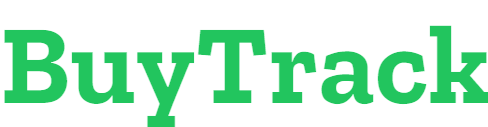

<p align="center">
  
  <a href="https://toshiominei.com">
<p>

<p align="center">
  A purchase order tracker made for collectors
</p>

<p align="center">
  
  <a href="http://makeapullrequest.com">
    
  </a>
</p>

## 🔥 Features

- Find a store to grow your collection.
- Manage your purchase orders.
- Track your deliveries.
- Get reports about your purchases.

Dev features:

- `Typescript` enabled.
- Maintained code format with `Prettier` & `Eslint`.
- Styling with `Tailwind`
- `React Hook Forms` for from management.
- Database handling with `Prisma`.
- Authentication with `Next Auth`.
- Ready to deploy in `Vercel`.

## 🛠 Installation & Set Up

1. Install dependencies:

```sh
npm install
```

2. Set up env variables.

```
# .env
NEXTAUTH_SECRET=*********
NEXTAUTH_URL=*********
GOOGLE_CLIENT_ID=*********
GOOGLE_CLIENT_SECRET=*********
DATABASE_URL=*********
```

3. Start dev server:

```sh
npm run dev
```

## 👤 Author

This project was developed by Sergio Toshio Minei. You can find me here:

- Website: https://toshiominei.com
- Facebook: [@MineiToshio](https://facebook.com/MineiToshio)
- Instagram: [@MineiToshio](https://instagram.com/MineiToshio)
- Twitter: [@MineiToshio](https://twitter.com/MineiToshio)
- Github: [@MineiToshio](https://github.com/MineiToshio)
- LinkedIn: [@MineiToshio](https://linkedin.com/in/MineiToshio)

## 🤝 Contributing

All contributions are welcome. If you see a bug or want to implement a new feature, feel free to make a PR.

## 👏🏻 Show your support

Give a ⭐️ if you like the project!